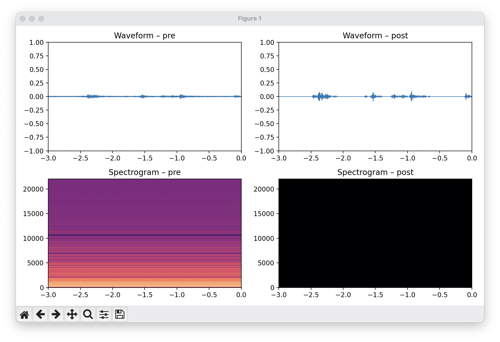

# Voice Equalizer 🗣️🎛️

A light-weight, real-time microphone equalizer written in Python that you can route into OBS, Discord, Zoom, etc. I made this during this livestream: https://x.com/omarish/status/1931409094910357539

## Why?

* Audio quality can be the difference between a good and a great livestream.

## How to Run

I've only designed this with MacOS in mind. PRs are welcome if you'd like to add support for other operating systems.

### Setup

(TODO: add setup instructions that use uv properly.)

#### List your audio devices

```sh
python -m sounddevice
```

This will give you a list of sound devices, like this for example:

```
0 Built-in Microphone …
1 MacBook Pro Speakers …
2 BlackHole 2ch …
```

Pick your input and output. I recommend making your output BlackHole or something equivalent.

### Tuning

This will ask you for the sounds you want to include, and will record short samples of each.

```sh
make tune PRESET=livestreaming.json
```

### Running

With that tuning preset, run like this:

```sh
make run PRESET=livestreaming.json INPUT="Yeti GX, Core Audio" OUTPUT="BlackHole 2ch, Core Audio"
```

This will run the equalizer in your terminal.

If you want to see a visualization of this EQ, run the above command with GUI=1, and you'll get a visualization like this:



## Quick start

1. **Install [UV](https://github.com/astral-sh/uv)** (if you haven't already):

```bash
brew install uv # macOS
```

2. **Create a virtual env & install deps** (all *via* UV):

```bash
uv venv .venv
uv pip -p .venv/bin/python install -e .
# optional, activate for shell convenience
source .venv/bin/activate
```

3. **List your audio devices** (optional):

```bash
python -m sounddevice
```

4. **Run the equalizer** (substitute device names or indices as needed):

```bash
python -m voice_equalizer --input "Built-in Microphone" --output "BlackHole 2ch"
```

---

## Customisation

* Change sample-rate & latency: `--samplerate 44100 --frames 512`
* Modify the EQ bands inside `design_eq()` – each stage is a regular SciPy IIR filter expressed as *second-order sections*.
* Adjust the noise-gate threshold in `_process()` (`-45 dBFS` by default).

---

## License

MIT

## AI

This was mostly generated by ChatGPT O3.